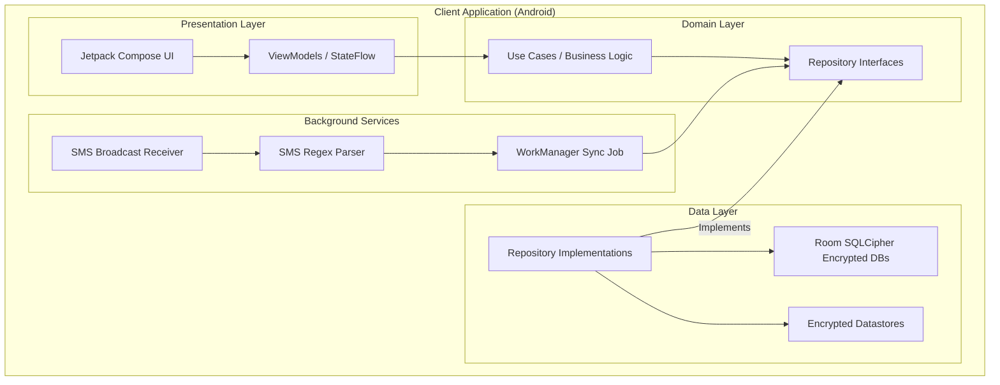
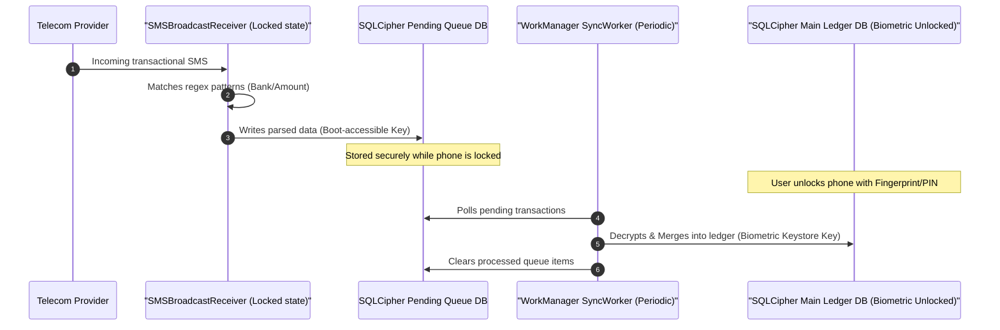

# LedgerFlow: Personal Financial Intelligence System

LedgerFlow is a secure, privacy-first, offline-first personal financial intelligence system engineered in Kotlin and Jetpack Compose.

---

## 1. Modular Architecture

The project implements a strict clean architecture module configuration to ensure maintainability and separation of concerns:

```
LedgerFlow/
│
├── core/
│   ├── common/           # Precision currency math and date helpers
│   ├── security/         # Keystore encryption wrappers and SQLCipher utilities
│   └── ui/               # Custom Material 3 theme and design system components (BaseCard, Type, Color)
│
├── domain/               # Pure Kotlin business rules, entities, and repository interfaces
│
├── data/                 # Room DB entities, SQLCipher encrypted clients, and Datastore repositories
│
├── services/             # Background SMS broadcast receivers, WorkManager parsing, and PBKDF2 ZIP backups
│
├── presentation/         # ViewModels, type-safe Compose Navigation, and polished feature screens
│
└── app/                  # Application runner, build properties, and Hilt modules
```

---

## 2. System Architecture & Workings

LedgerFlow is designed as an offline-first system prioritizing cryptography, biometric verification, and automated workflows.

### Component Dependency Architecture



### Transaction Lifecyle: SMS Broadcast to Ledger Sync

Unlike regular financial apps, LedgerFlow captures bank transaction messages asynchronously even when the device is locked, without compromising the master ledger database encryption key.



---

## 3. Premium UI/UX Polish

LedgerFlow has been redesigned to reflect a premium, professional personal finance intelligence tool, focusing on visual trust, high-contrast readability, and calm colors:

*   **Custom Dark/Light Theme**: Enforces a bespoke Material 3 palette of slate blue, dark indigo, and emerald green.
*   **Net Balance Hero Cockpit**: The Dashboard features a centered massive balance display, side-by-side green (Income) and red (Expense) indicators, and detailed progress charts for current category budgets.
*   **Spend Analysis Reports**: A dedicated reports screen combining category and transaction date ranges to render clean percentage progress indicators and total monthly savings metrics.
*   **Clean Inputs & Form Grouping**: Outlined forms using flat custom-shaped borders, dynamic category selector dropdowns, and split allocation validation banners.
*   **Tree Subcategory Layouts**: Category Manager displays parent-child branches under a single scroll view utilizing structured indentations (`└─`).

---

## 4. Core Security & Privacy Models

*   **FLAG_SECURE**: Configured in `MainActivity` to block operating system screenshot capture and screen recording.
*   **Two-Tier Encryption Database Layout**:
    1.  **Main Ledger Database**: Decrypted via a SQLCipher factory key wrapped inside a biometric-authenticated Android Keystore key. Accessible only when the app is active and unlocked.
    2.  **Pending Queue Database**: Decrypted via a SQLCipher factory key wrapped using a boot-accessible Keystore key. This allows the background SMS receiver worker to write parsed text transactions to the queue even when the device is locked.
*   **Password-derived backups**: Backups compile the database files into a compressed ZIP stream encrypted using AES-256-GCM. The key is derived using PBKDF2 with 100,000 iterations and a random salt.

---

## 5. Development & Verifications

To open the project and run verification tests:

1.  Open Android Studio (Iguana / Koala or newer).
2.  Select **File -> Open** and target this project folder: `d:\LedgerFlow`.
3.  Let Gradle sync the dependency catalog defined in `gradle/libs.versions.toml`.
4.  To run the test suite, open the terminal in Android Studio and run:
    ```bash
    ./gradlew test
    ```
5.  Or navigate to individual files and run them:
    *   [`CurrencyUtilsTest.kt`](file:///d:/LedgerFlow/core/common/src/test/java/com/ledgerflow/core/common/util/CurrencyUtilsTest.kt) - Tests precision double/cent math.
    *   [`SmsParserTest.kt`](file:///d:/LedgerFlow/services/src/test/java/com/ledgerflow/services/sms/SmsParserTest.kt) - Validates banking SMS regex patterns and spam exclusion filters.
    *   [`BackupEngineTest.kt`](file:///d:/LedgerFlow/services/src/test/java/com/ledgerflow/services/backup/BackupEngineTest.kt) - Validates GCM encrypt/decrypt iterations.
