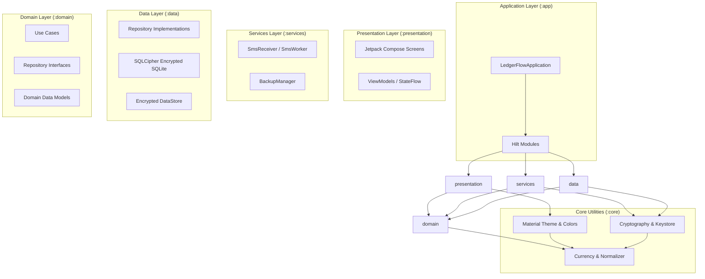
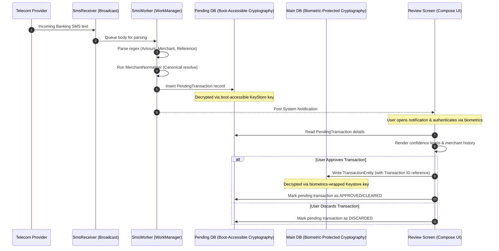
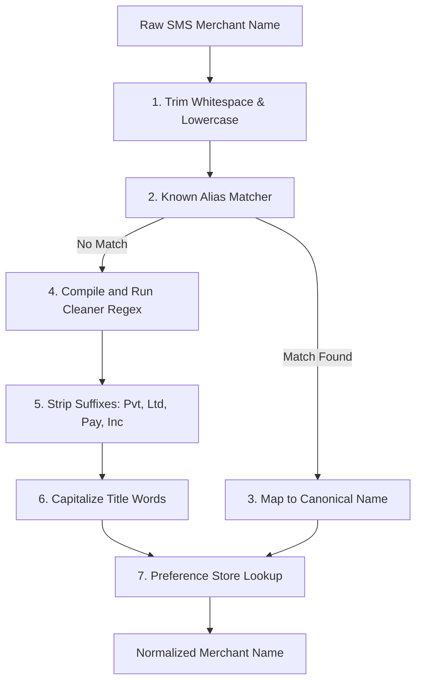
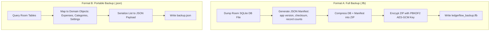

# LedgerFlow: Personal Financial Intelligence System

LedgerFlow is a secure, privacy-first, offline-first personal financial intelligence system engineered in Kotlin, Jetpack Compose, Room, and Hilt. It captures banking notifications, normalizes transaction records, and builds secure ledger reports without relying on external cloud synchronization.

---

## 1. Modular Directory Structure

The project implements a strict Clean Architecture layout using Gradle subprojects to isolate business logic, platform services, and user interfaces:

```
LedgerFlow/
│
├── core/
│   ├── common/           # Precision currency math, date utilities, and MerchantNormalizer
│   ├── security/         # Android Keystore providers, AES-256-GCM engines, and SQLCipher passphrase factories
│   └── ui/               # Custom Material 3 branding, typography models, palette colors, and shared UI assets
│
├── domain/               # Pure Kotlin layer: entities, use cases, and repository interfaces
│
├── data/                 # Room database schemas, SQLCipher clients, migrations, and Datastore repositories
│
├── services/             # Background SMS broadcast receivers, WorkManager parsing, and ZIP backup implementations
│
├── presentation/         # ViewModels, type-safe Compose Navigation paths, and responsive feature views
│
└── app/                  # Main Application class, AndroidManifest, build files, and Hilt dependency modules
```

---

## 2. System Architecture & Component Mapping

### Component Dependency Diagram

LedgerFlow follows a strict unidirectional dependency structure where inner layers have no knowledge of outer layers:



---

## 3. Data Movement & Transaction Lifecycles

### Transaction Lifecycle: SMS parsing to Room Ledger

LedgerFlow processes incoming transactions in a dual-tier database layout, allowing background capture when the phone is locked, and full ledger merging once the user authenticates via biometrics.



---

## 4. Merchant Normalization Engine Pipeline

The `MerchantNormalizer` processes raw bank payee names to build clean records, matching aliases and compiling regex templates before registering preferred category predictions.



---

## 5. Backup & Restore Architecture

LedgerFlow preserves user records offline using two isolated backup pipelines:



---

## 6. Security Tiers & Cryptography Model

LedgerFlow maintains a robust offline security configuration to guard financial records:

1.  **FLAG_SECURE**: Set on the `Window` in `MainActivity` to disable screenshots, screen recorders, and previews in task managers.
2.  **Two-Tier Keystore Wrapper**:
    *   **Pending Queue DB Key**: Generated using Android KeyStore with authentication requirements bypassed. This allows background WorkManager tasks to write parsed SMS events even when the phone is booted but locked.
    *   **Main Ledger DB Key**: Wrapped under a master key requiring biometric validation. Room cannot open the main database until the user performs biometric verification.
3.  **PBKDF2 Backups**: Full ZIP packages are encrypted via AES-256-GCM. The encryption key is derived using `PBKDF2WithHmacSHA1` using 100,000 iterations and a random salt value.
4.  **Schema Verification**: Before executing restores, the manifest's SHA-256 checksum and database version are verified, ensuring corrupt or incompatible files are aborted before replacing active database sectors.

---

## 7. Build, Verification & Tests

To open the project and run verification tests:

1.  Open Android Studio (Iguana / Koala or newer).
2.  Import this project directory: `d:\LedgerFlow`.
3.  Set the correct `$env:JAVA_HOME` pointing to JDK 17/21 in your command shell.
4.  To run the full suite of unit and integration tests:
    ```bash
    ./gradlew test
    ```
5.  Or run tests for individual components:
    *   [`CurrencyUtilsTest.kt`](file:///d:/LedgerFlow/core/common/src/test/java/com/ledgerflow/core/common/util/CurrencyUtilsTest.kt) - Tests double/cent precision conversions.
    *   [`SmsParserTest.kt`](file:///d:/LedgerFlow/services/src/test/java/com/ledgerflow/services/sms/SmsParserTest.kt) - Validates banking SMS regex patterns and spam exclusion filters.
    *   [`BackupEngineTest.kt`](file:///d:/LedgerFlow/services/src/test/java/com/ledgerflow/services/backup/BackupEngineTest.kt) - Validates GCM encryption/decryption keys.
    *   [`DatabaseMigrationTest.kt`](file:///d:/LedgerFlow/data/src/test/java/com/ledgerflow/data/db/migration/DatabaseMigrationTest.kt) - Validates Room default seeding, resets, and version migrations.
